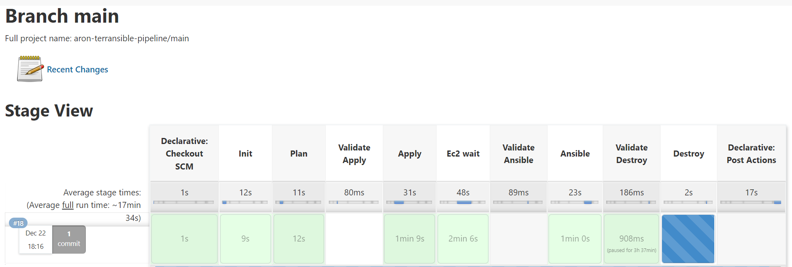

# Introduction 
Tutorial Project based off of Derek Morgan's morethancertified course, [Devops in the Cloud](https://morethancertified.teachable.com/p/devops-in-the-cloud).

Terraform automatically deploys subnets, route tables, internet gateways, and Ec2 instances. Ansible deploys a Grafana, Prometheus, and Jenkins container. 
Jenkins polls for push requests and is able to automatically trigger Terraform through Jenkinsfile depending on what Git branch. 
If it is pushed to the dev branch, options validate each step like Terraform plan, ansible deploy, and Terraform destroy in order to test each stage in the process. 
If it is pushed to the main branch all stages the validation steps are skipped. 

# What I learned
- Refreshed my knowledge about import Terraform topics like deploying and referencing the documentation in order to deploy infrastructure. 
- Learned more about Terraform count and how to use tfvars files for production and development.
- How to deploy infrastructure with ansible
- Looping in ansible and navigating the documentation.
- How to implement a Jenkins pipeline and steps to execute various shell commands.
- A better understanding of testing in a devops environment and best practices.

# Pipeline 

